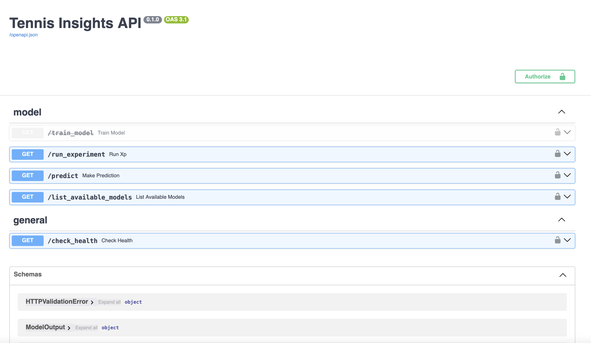

Check out the configuration reference at https://huggingface.co/docs/hub/spaces-config-reference

# tennis-api

This module is intended for managing tennis data insertion into the database and providing an interface for data retrieval and tennis match predictions.

## Docker Install  

To get the service up and running locally, simply follow the steps hereafter:

### Build the API image

From the root of the project:
```bash
$> docker build . -t tennis_api:latest -f Dockerfile
```

For building with pytest capabilities, run:
```bash
$> docker build . --build-arg TEST=true -t tennis_api:latest -f Dockerfile
```

### Run it

From the root of the project:  
```bash
$> docker run --rm -p 7860:7860 --env-file .env tennis_api:latest
```  

Then go to [http://localhost:7860/](http://localhost:7860/)

The API should be accessible:  
  

## Resources  

Website: [http://www.tennis-data.co.uk/alldata.php](http://www.tennis-data.co.uk/alldata.php)  

## License  

©2025